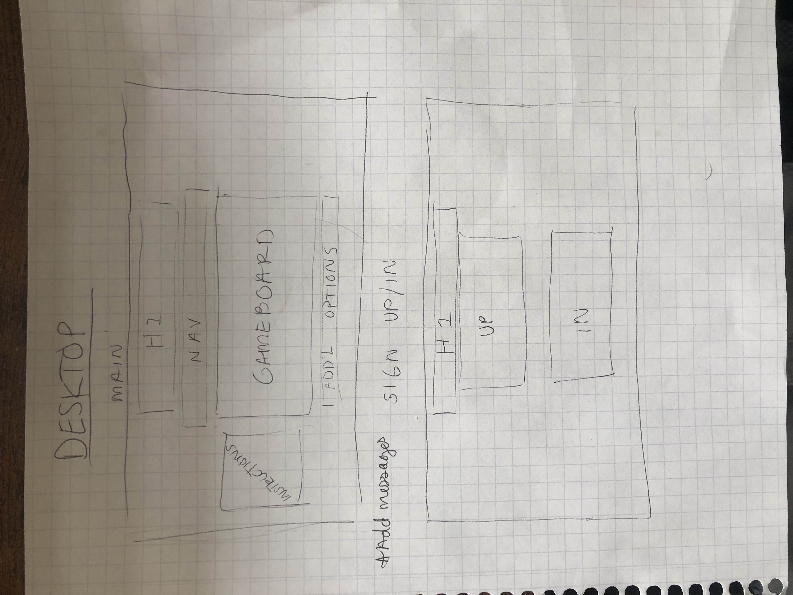
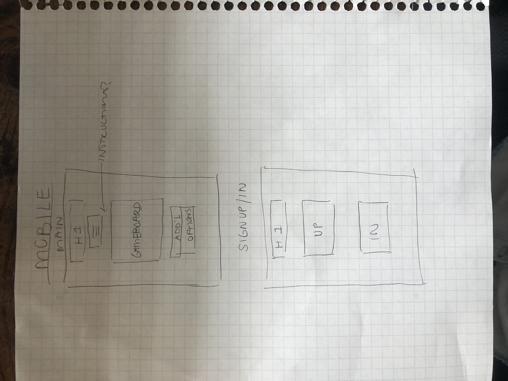

# Tic-Tac-Toe Game

## Deployment link

https://laurenmenendez.github.io/game-project-client/

## About the app

This application features a virtual tic-tac-toe game that a user can play against themselves. A user will be required to sign up, then sign in in order to play. They will also be able to sign out when they are finished playing. They have the ability to change their password at any time while they are signed in. Additionally, they have the opportunity to start a new game when their game is over. They will be notified when the game is over and of the winner, or if there is a tie, and will be prompted to start a new game. The user will also be able to see how many games they have played on their account.

## User Stories

- I can sign up and confirm my sign up was successful
- I can sign in and confirm my sign in was successful
- I can sign out and confirm my sign out was successful
- I can change my password
- I can start a new game with one click
- When I click an empty cell in the gameboard, my token appears
- The tokens (x and o) alternate with each move
- I cannot alter the token in a cell that is already filled
- When there are 3 tokens in a row, I am informed that the game is over and who the winner is
- If there is a tie, I am informed the game is over
- Once the game is over, I cannot keep playing
- I can start a new game after the previous game is over
- I can see how many games I have played with one click

## Wireframes

